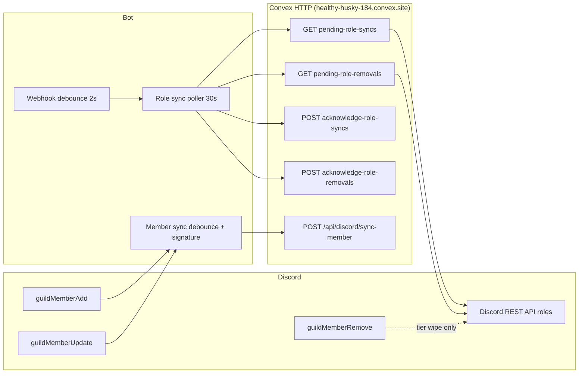

# Discord Synchronization Audit

**Repository:** `discord-bot`  
**Audit date:** 2026-05-31  
**Scope:** How Discord membership and related state is synchronized with the Hercules website (Convex HTTP backend at `https://healthy-husky-184.convex.site` by default).  
**Method:** Static code review only — no code was modified.

---

## Executive summary

This bot implements **two separate synchronization systems**:

| Direction | Data | Mechanism | Primary files |
|-----------|------|-----------|---------------|
| **Discord → website** | Member roster (id, username, nickname, join date, roles) | **Event-driven** (+ optional interval backfill + manual slash command) | `bot.js`, `lib/memberSyncApi.js` |
| **Website → Discord** | Event ban / probation roles | **Polling** (30s default) + **webhook-triggered** re-poll | `banExpiryChecker.js`, `lib/discordBanApi.js`, `lib/eventBanWebhook.js` |

**Membership leaves are not synced.** `guildMemberRemove` does not call the website; it only runs guardian tier-wipe logic.

There is **no Convex client SDK** in this repo. All backend access is via **HTTP routes** on `*.convex.site`. Convex `query` / `mutation` function names live in the separate Hercules/Convex backend project, not here.

---

## 1. How Discord membership is synchronized to the website

### 1.1 Payload and transport

When a member is synced, the bot builds a JSON payload and POSTs it to Convex:

**Endpoint:** `POST {CONVEX_API_BASE_URL}/api/discord/sync-member`  
**Auth:** `Authorization: Bearer {DISCORD_SYNC_API_KEY | EVENT_BAN_WEBHOOK_SECRET}`

**Payload fields** (`lib/memberSyncApi.js` → `buildMemberPayload`):

| Field | Source |
|-------|--------|
| `id` | Discord user snowflake |
| `username` | Discord username |
| `nickname` | Server nickname, or `null` |
| `joined_at` | ISO timestamp from `member.joinedAt` (falls back to `new Date()` if missing) |
| `roles` | Array of `{ id, name }` for non-`@everyone` roles, or `null` if none |

**Retry behavior:** Up to 3 retries on HTTP 429, 5xx, or network errors, with exponential backoff (500ms base, 10s cap, jitter).

### 1.2 Sync flow

```
guildMemberAdd ──────────────┐
                             ├──► scheduleMemberSync (2s debounce per user)
guildMemberUpdate ───────────┘         │
  (nickname or roles only)             ▼
                             syncMemberWithGuards
                                       │
                             signature unchanged? ──► skip
                                       │
                                       ▼
                             syncMemberToWebsite
                                       │
                                       ▼
                             POST /api/discord/sync-member

/syncmembers (manual) ──► syncAllGuildMembers ──► guild.members.fetch() ──► POST per member (100ms spacing)

Optional: setInterval ──► runFullMemberBackfill ──► syncAllGuildMembers
  (only if MEMBER_SYNC_BACKFILL_INTERVAL_MS > 0; default 0 = disabled)
```

### 1.3 Deduplication and guards

- **Bots** are skipped everywhere.
- **API key required:** If `DISCORD_SYNC_API_KEY` (and fallback `EVENT_BAN_WEBHOOK_SECRET`) are unset, all automatic member sync is disabled.
- **Per-user debounce:** `MEMBER_SYNC_UPDATE_DEBOUNCE_MS` (default **2000 ms**) coalesces rapid updates.
- **In-memory signature cache** (`memberSyncSignatures` in `bot.js`): A member is not re-POSTed unless nickname, roles, username, or join date in the signature changed. Signatures are lost on bot restart.
- **Full guild sync** (`syncAllGuildMembers`): Fetches all members via `guild.members.fetch()`, POSTs each one with `MEMBER_SYNC_PER_MEMBER_DELAY_MS` (default **100 ms**) between requests. Does **not** use the signature cache — every member gets a POST attempt.

### 1.4 Triggers

| Trigger | File | Behavior |
|---------|------|----------|
| `guildMemberAdd` | `bot.js` | Welcome flow, then `scheduleMemberSync(member, "guildMemberAdd")` |
| `guildMemberUpdate` | `bot.js` | Sync only if nickname or role membership changed |
| `/syncmembers` slash command | `commands/syncmembers.js` | Admin-triggered full guild sync |
| Scheduled backfill | `bot.js` `ready` handler | Full guild sync on interval if env enabled |

### 1.5 Known gaps

1. **`guildMemberRemove` does not sync leaves** — the website roster may retain members who left Discord until a manual `/syncmembers` or enabled backfill corrects it (and even backfill only upserts current members; it does not explicitly delete leavers unless the backend infers absence).
2. **`guildMemberUpdate` ignores non-nickname, non-role changes** — e.g. a Discord username change alone does not trigger sync (even though the signature includes username).
3. **Signature cache is in-memory only** — after restart, the next qualifying event may re-POST unchanged members.
4. **No Convex reads during member sync** — the bot only writes (POST); it never queries the website for member state.

---

## 2. Polling vs event-driven

### Membership (Discord → website)

| Mode | Active? | Details |
|------|---------|---------|
| **Event-driven** | Yes (default) | `guildMemberAdd`, `guildMemberUpdate` |
| **Polling** | No (default) | `MEMBER_SYNC_BACKFILL_INTERVAL_MS` defaults to **0** (disabled) |
| **Manual** | On demand | `/syncmembers` |

**Verdict:** Membership sync is **primarily event-driven**. Polling exists only as an opt-in backfill.

### Ban/probation roles (website → Discord)

| Mode | Active? | Details |
|------|---------|---------|
| **Polling** | Yes (default) | Every `ROLE_SYNC_POLL_MS` (default **30 s**) |
| **Webhook-accelerated poll** | Optional | `POST /webhooks/event-bans` debounces then runs the same poll function |
| **Immediate on startup** | Yes | `syncRolesFromSheet(client)` once on `ready`, plus first poll after **15 s** |

**Verdict:** Website→Discord role sync is **polling-based**, with webhooks used only to trigger an earlier poll cycle (not a separate push payload).

---

## 3. Every Discord client event used

All handlers are registered in `bot.js`.

| Event | Handler | Sync-related? | Purpose |
|-------|---------|---------------|---------|
| `client.once("ready")` | Lines ~407–721 | Partially | Starts role-sync poller, optional member backfill interval, DM/scrim schedulers, scheduled-events cache refresh, slash command registration |
| `interactionCreate` | Lines ~725–1214 | Partially | Slash commands, buttons, modals; `/syncmembers` triggers full member sync |
| `messageDelete` | Lines ~1220–1226 | No | Rules/bans message tracking (`handleBansMessageDeleted`) |
| `guildMemberAdd` | Lines ~1230–1266 | **Yes** | Welcome + member sync |
| `guildMemberUpdate` | Lines ~1268–1291 | **Yes** | Member sync on nickname/role changes |
| `guildMemberRemove` | Lines ~1295–1305 | **No** (membership) | Guardian tier wipe only (`handleGuardianRemoval`) |

### Gateway intents (`bot.js`)

```javascript
GatewayIntentBits.Guilds
GatewayIntentBits.GuildMembers      // required for member events + fetch
GatewayIntentBits.GuildMessages
GatewayIntentBits.MessageContent
GatewayIntentBits.DirectMessages
GatewayIntentBits.GuildScheduledEvents
```

**Not subscribed:** `GuildPresences`, `GuildVoiceStates`, `GuildMessageReactions`, etc.

### Events explicitly not used for sync

`presenceUpdate`, `userUpdate`, `guildMemberAvailable`, `voiceStateUpdate`, `messageCreate`, and all other Discord gateway events.

---

## 4. Scheduled tasks, intervals, cron jobs, and repeated sync

There is **no `node-cron` or OS cron** in this repository. All repetition uses `setInterval`, `setTimeout`, or Google Apps Script triggers external to the bot process.

### 4.1 Sync-related intervals

| Location | Interval / delay | Function | Sync type |
|----------|------------------|----------|-----------|
| `banExpiryChecker.js` | **15 s** after ready, then every **`ROLE_SYNC_POLL_MS`** (default **30 s**) | `processPendingRoleSyncs` | Website → Discord ban/probation roles |
| `bot.js` `ready` | Once on ready | `syncRolesFromSheet(client)` | Same as above (immediate first poll) |
| `bot.js` `ready` | Every **`MEMBER_SYNC_BACKFILL_INTERVAL_MS`** if **> 0** (default **0**) | `runFullMemberBackfill` | Discord → website full roster |
| `lib/eventBanWebhook.js` | **`EVENT_BAN_WEBHOOK_DEBOUNCE_MS`** (default **2 s**) after webhook | `processPendingRoleSyncs` | Triggers role-sync poll early |

### 4.2 Non-membership intervals (same process, not roster sync)

| Location | Interval | Purpose |
|----------|----------|---------|
| `bot.js` `ready` | **90 s** delay, then **30 s** poll | DM scheduler (`commands/dm.js`) |
| `bot.js` `ready` | **100 s** delay, then **30 s** poll | Scrim remind scheduler (`lib/scrimEventSheet.js`) |
| `bot.js` `ready` | **3 min** | Scheduled Discord events cache refresh (`lib/guildScheduledEvents.js`) |
| `lib/guildScheduledEvents.js` | Cache TTL **60 s**, stale **5 min**, autocomplete throttle **2.5 s** | Event list caching for slash commands |
| `lib/roleSyncHistory.js` | Debounced `setTimeout` | Persist processed ban IDs to local JSON |
| `welcome-ping/index.js` | **45 s** batch | Welcome channel messages |
| `fly.toml` | Health check **30 s** | `GET /health` — no sync |

### 4.3 External trigger (Google Sheets → bot webhook)

`scripts/google-apps-script-event-bans-trigger.js` — Apps Script `onSpreadsheetChange` POSTs to `https://welcome-ping.fly.dev/webhooks/event-bans`, which debounces and runs `processPendingRoleSyncs`. This accelerates role sync when the Event Bans sheet changes; it does **not** push member data.

### 4.4 HTTP endpoints served by the bot (inbound, not Convex)

| Method | Path | Handler | Sync effect |
|--------|------|---------|-------------|
| `GET` | `/`, `/health` | Health check | None |
| `POST` | `/webhooks/event-bans` | `createWebhookRequestHandler` | Schedules role-sync poll |
| `POST` | `/api/tier-clear` | `createTierClearHandler` | Clears tier roles in Discord (website-initiated, no Convex call from bot) |
| `GET` | `/api/tier-clear/status` | `createTierClearHandler` | Job status (local only) |

---

## 5. Convex reads and writes during synchronization

The bot does **not** import `@convex-dev/*` or call Convex queries/mutations by name. It uses **axios HTTP** to `{baseUrl}/api/discord/*`. Each HTTP request maps to a Convex **httpAction** on the backend (exact function names are in the Hercules Convex project).

### 5.1 Membership sync (Discord → website)

| HTTP | Bot function | Inferred Convex operation | When |
|------|--------------|---------------------------|------|
| `POST /api/discord/sync-member` | `postMemberPayloadWithRetry` → `syncMemberToWebsite` | **Write** (upsert member) | Each qualifying join/update, each member in full sync |

**Reads from bot:** none.

### 5.2 Role sync (website → Discord)

| HTTP | Bot function | Inferred Convex operation | When |
|------|--------------|---------------------------|------|
| `GET /api/discord/pending-role-syncs` | `fetchPendingRoleSyncs` | **Read** (list pending role assignments) | Every poll cycle (~30 s) + webhook-triggered polls |
| `GET /api/discord/pending-role-removals` | `fetchPendingRoleRemovals` | **Read** (list pending role removals) | Every poll cycle (parallel with adds) |
| `POST /api/discord/acknowledge-role-syncs` | `acknowledgeRoleSyncs` | **Write** (mark adds processed) | After each successfully handled add entry (`{ banIds: [...] }`) |
| `POST /api/discord/acknowledge-role-removals` | `acknowledgeRoleRemovals` | **Write** (mark removals processed) | Batched after removal pass (`{ banIds, pendingRoleRemovalIds }`) |

**Local Discord writes (not Convex):** `assignRolesForBanType` / `removeRolesForBanType` in `lib/eventBanRoles.js` modify guild member roles directly via Discord API.

### 5.3 Other Convex HTTP in this repo (not membership sync)

These use the same Convex host but are unrelated to roster synchronization:

| Endpoint | File | Purpose |
|----------|------|---------|
| `GET /api/scrim-events/by-code/...` | `commands/spin.js` | Scrim event lookup |
| `POST /api/scrim-events/.../entries` | `commands/spin.js` | Scrim entry submission |

### 5.4 Resolving exact Convex function names

To map HTTP routes to `query` / `mutation` / `httpAction` identifiers, inspect the Convex backend deployed to `healthy-husky-184` and search for route handlers matching:

- `/api/discord/sync-member`
- `/api/discord/pending-role-syncs`
- `/api/discord/acknowledge-role-syncs`
- `/api/discord/pending-role-removals`
- `/api/discord/acknowledge-role-removals`

That backend is **not present** in this workspace.

---

## 6. Estimated Convex operations per day

Estimates count **HTTP calls from the bot to Convex** (each typically equals one httpAction invocation; the backend may perform additional internal DB reads/writes per request that are not visible here).

### 6.1 Baseline: role-sync polling (always on when API key is set)

| Operation | Formula | Default daily count |
|-----------|---------|---------------------|
| Poll cycles | `86,400 s ÷ ROLE_SYNC_POLL_MS` | 86,400 ÷ 30 = **2,880** |
| `GET pending-role-syncs` | 1 per poll | **2,880** |
| `GET pending-role-removals` | 1 per poll | **2,880** |
| Startup polls | ~2 on boot (immediate + 15 s delayed) | **~4** |

**Baseline reads (empty pending queues): ~5,764 GET requests/day**

**Baseline writes (empty pending queues): 0**

Each poll runs both GETs even when both lists return empty (`processPendingRoleSyncs` fetches then returns early).

### 6.2 Variable: role-sync acknowledgements

Depends on event-ban activity on the website:

| Operation | Estimate |
|-----------|----------|
| `POST acknowledge-role-syncs` | ≈ 1 per processed add entry |
| `POST acknowledge-role-removals` | ≈ 1 batch per poll cycle that had removals (often 0–1 POST per cycle with work) |

**Example:** 20 new bans and 20 expirations per day → roughly **20–40 write POSTs/day** (adds are one POST each; removals may batch).

Webhook-triggered polls (sheet edits) add **extra poll cycles** (each = 2 GETs) but do not change the 30 s interval baseline. A busy sheet day with 50 webhook fires could add ~**100 extra GETs**.

### 6.3 Variable: membership sync (Discord → website)

| Scenario | POST `/sync-member` count |
|----------|---------------------------|
| Steady state (events only, backfill off) | ≈ joins + nickname/role changes per day |
| Bot restart | 0 until next qualifying event (signatures cleared) |
| One `/syncmembers` run | ≈ **N** (current guild member count, including bots skipped) |
| Backfill enabled every **T** ms | ≈ **N × (86,400,000 ÷ T)** per day |

**Member count (N)** is not configured in this repo. Guild ID default: `1371615693392576580`.

**Illustrative event-only estimates (backfill disabled):**

| Daily activity | POST writes/day |
|----------------|-----------------|
| Low (5 joins, 15 role/nickname updates) | **~20** |
| Moderate (20 joins, 80 updates) | **~100** |
| High (50 joins, 200 updates) | **~250** |

Full sync duration (manual or backfill): approximately `N × (100 ms + HTTP latency)` minimum — e.g. **1,000 members ≈ 100+ seconds** of spacing alone.

### 6.4 Combined daily totals (typical production assumptions)

Assumptions: API key set, backfill **disabled** (default), default 30 s role poll, low–moderate member activity, minimal ban churn.

| Category | Reads (GET) | Writes (POST) |
|----------|-------------|---------------|
| Role sync polling | **~5,760** | **0** (idle) |
| Role sync acks | — | **~0–40** (activity-dependent) |
| Member sync events | **0** | **~20–100** |
| **Total (typical day)** | **~5,760–5,860** | **~20–140** |

**Rough total HTTP operations to Convex: ~5,800–6,000/day** under idle ban queues and moderate membership churn.

### 6.5 High-load scenarios

| Scenario | Additional impact |
|----------|-------------------|
| `MEMBER_SYNC_BACKFILL_INTERVAL_MS = 3_600_000` (hourly), N = 2,000 members | +**48,000** POST/day |
| Heavy sheet webhook usage (100 extra polls/day) | +**200** GET/day |
| Active ban day (200 processed entries) | +**~200** POST acks/day |

### 6.6 Cost note

Convex billing counts internal query/mutation/document operations, not just HTTP requests. The backend handler for each route may execute multiple DB operations per call. Use Convex dashboard metrics on `healthy-husky-184` for authoritative usage; the figures above are **bot-side HTTP call counts** only.

---

## Configuration reference

### API base URL and auth (`lib/discordApi.js`)

| Variable | Default / fallback |
|----------|-------------------|
| `CONVEX_API_BASE_URL` / `SCRIM_EVENTS_API_BASE_URL` | `https://healthy-husky-184.convex.site` |
| `DISCORD_SYNC_API_KEY` | Required for sync; falls back to `EVENT_BAN_WEBHOOK_SECRET` |
| `GUILD_ID` | `1371615693392576580` |

### Member sync → website

| Variable | Default | Effect |
|----------|---------|--------|
| `MEMBER_SYNC_UPDATE_DEBOUNCE_MS` | `2000` | Debounce after add/update |
| `MEMBER_SYNC_BACKFILL_INTERVAL_MS` | `0` | Full-guild poll interval; `0` = off |
| `MEMBER_SYNC_PER_MEMBER_DELAY_MS` | `100` | Spacing in full sync |
| `MEMBER_SYNC_REQUEST_TIMEOUT_MS` | `15000` | HTTP timeout |
| `MEMBER_SYNC_MAX_RETRIES` | `3` | POST retries |
| `MEMBER_SYNC_RETRY_BASE_DELAY_MS` | `500` | Backoff base |
| `MEMBER_SYNC_RETRY_MAX_DELAY_MS` | `10000` | Backoff cap |

### Role sync ← website

| Variable | Default | Effect |
|----------|---------|--------|
| `ROLE_SYNC_POLL_MS` | `30000` | Poll interval |
| `ROLE_SYNC_ONLY_AFTER` | unset | Skip adds with timestamp before cutoff (ack-only) |
| `ROLE_SYNC_STATE_PATH` | `data/role-sync-state.json` | Local dedup persistence |
| `ROLE_SYNC_STATE_MAX_IDS` | `20000` | Max tracked ban IDs |
| `EVENT_BAN_WEBHOOK_SECRET` | unset | Webhook auth; API key fallback |
| `EVENT_BAN_WEBHOOK_DEBOUNCE_MS` | `2000` | Webhook → poll debounce |

---

## Key source files

| File | Role |
|------|------|
| `bot.js` | Discord events, debounce/signature logic, backfill interval, HTTP server |
| `lib/memberSyncApi.js` | Member payload, POST `/sync-member`, full guild sync |
| `lib/discordApi.js` | Base URL and auth headers |
| `commands/syncmembers.js` | Manual full sync slash command |
| `banExpiryChecker.js` | Role sync poll loop |
| `lib/discordBanApi.js` | Convex GET/POST for pending roles and acks |
| `lib/eventBanWebhook.js` | Webhook → debounced poll |
| `lib/eventBanRoles.js` | Discord-side role apply/remove |
| `lib/roleSyncEligibility.js` | Cutoff and pending flags for role entries |
| `lib/roleSyncDedupe.js` | Dedupe pending add/remove lists |
| `lib/roleSyncHistory.js` | Local processed-ID persistence |
| `lib/guardianWatch.js` | `guildMemberRemove` tier wipe (not website sync) |

---

## Architecture diagram



---

## Recommendations (informational — not implemented)

1. **Sync leaves:** Consider handling `guildMemberRemove` with a Convex endpoint to mark members inactive or remove them.
2. **Username changes:** Extend `guildMemberUpdate` to detect `oldMember.user.username !== newMember.user.username`.
3. **Backfill vs cost:** If hourly backfill is enabled for a large guild, member POST volume dominates Convex usage; event-driven sync alone is much cheaper.
4. **Backend mapping:** Add a cross-reference doc in the Convex repo listing httpAction → mutation/query names for each `/api/discord/*` route.
