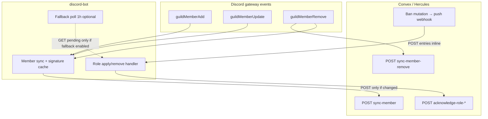

# Discord Sync Refactor Plan

**Status:** Phase 1 implemented (bot) — Convex push webhook pending backend work  
**Based on:** [DISCORD_SYNC_AUDIT.md](./DISCORD_SYNC_AUDIT.md) (2026-05-31)  
**Goal:** Event-driven synchronization wherever possible, minimizing Convex reads and writes while preserving all existing behavior.

---

## Current baseline (for comparison)

| Subsystem | Mechanism today | Daily Convex HTTP ops (typical) |
|-----------|-----------------|----------------------------------|
| Member roster → website | Discord events + optional backfill | ~0 reads, ~20–100 writes |
| Ban/probation roles ← website | **30 s polling** + webhook-triggered re-poll | **~5,760 reads**, ~0–40 writes |

**Polling is the dominant Convex cost.** Member sync is already mostly event-driven; role sync is not.

---

## Scope and constraints

### What “event-driven” means here

| Direction | Valid event sources | Notes |
|-----------|---------------------|-------|
| Discord → website | **Discord gateway events** (`guildMemberAdd`, `guildMemberUpdate`, `guildMemberRemove`, `userUpdate`) | Source of truth is Discord membership state |
| Website → Discord roles | **Push events from Convex/website** (HTTP webhooks) | Source of truth is Hercules ban/probation records; Discord gateway cannot signal “ban expired on website” |

Role sync **cannot** be driven by Discord gateway events as the primary mechanism. Ban assignments originate on the website; expiry is time-based in Convex. The refactor replaces **polling Convex** with **push notifications from Convex** (plus a slow safety net).

### Functionality that must be preserved

- Member upsert on join and on nickname/role changes (with dedup)
- Manual `/syncmembers` full guild sync
- Ban/probation role assignment and removal in Discord
- Eligibility rules (`ROLE_SYNC_ONLY_AFTER`, legacy flags, ack-only paths)
- Local dedup (`roleSyncHistory`, in-flight guards)
- Google Sheets `onSpreadsheetChange` → bot webhook
- Manual `/eventban sync` on-demand poll
- `/eventban summary` and `/eventban status` (sheet read-only — unchanged)
- Startup recovery after bot restart
- Retry/backoff on failed HTTP calls
- Guardian tier wipe on `guildMemberRemove` (orthogonal; must not regress)

---

## Recommended phasing

| Phase | Focus | Requires backend? | Risk |
|-------|--------|-------------------|------|
| **1** | Stop role-sync polling; push-driven role sync | Yes (Convex) | Medium |
| **2** | Complete member event coverage + write dedup | Partial (remove endpoint) | Low |
| **3** | Remove redundant polling/backfill; ops cleanup | Optional | Low |

Each phase can be approved independently. Phase 1 delivers ~99% of Convex read savings.

---

## Phase 1 — Replace role-sync polling with push events

### Change 1.1 — Convex pushes role-sync jobs to the bot (replaces 30 s poll)

**What changes**

1. **Convex backend:** When a ban/probation record becomes pending for Discord role apply or remove (create, update, expiry, manual unblock), Convex POSTs to the bot with the work item inline — no “wake up and poll” signal.

   Proposed bot endpoint (extend existing webhook or add sibling):

   ```
   POST /webhooks/role-sync
   Authorization: Bearer <secret>

   {
     "action": "assign" | "remove",
     "entries": [
       {
         "_id": "<banId>",
         "discordId": "<snowflake>",
         "banType": "minor event ban",
         "source": "eventBans" | "pendingRoleRemovals",
         "roleSyncRequestedAt": "<ISO8601 optional>"
       }
     ],
     "source": "convex" | "google-sheets"
   }
   ```

2. **Bot:** New handler applies entries through existing `processPendingEntries` / `assignRolesForBanType` / `removeRolesForBanType` / ack logic — **without** calling `fetchPendingRoleSyncs` or `fetchPendingRoleRemovals` first.

3. **Google Apps Script:** Either keep as-is (debounced poll trigger during migration) or update to pass through Convex-generated payloads if sheet edits flow through Convex first.

4. **Remove** the `setInterval` in `startBanExpiryChecker` (default behavior). Replace with optional long-interval fallback (Change 1.2).

**Why it reduces load**

Today every poll performs **2 Convex GETs** even when nothing is pending (~2,880 cycles/day × 2 = **5,760 reads/day**). Push delivery performs **0 reads** per idle minute; the bot only **writes acks** when it actually processes work.

**Estimated reduction**

| Metric | Before | After (typical day, ~30 ban events) | Reduction |
|--------|--------|-------------------------------------|-----------|
| Convex GETs | ~5,760/day | 0–48/day (fallback only, see 1.2) | **~99–100%** |
| Convex POST acks | ~0–40/day | ~30/day (same work, fewer duplicate acks) | ~0–25% fewer (no re-processing from poll overlap) |
| Bot HTTP inbound | Sheet webhooks only | +1 POST per Convex ban event | Negligible |

**Edge cases**

| Case | Mitigation |
|------|------------|
| Bot offline when Convex pushes | Convex retries with backoff; undelivered jobs stay `pending` until fallback poll or `/eventban sync` |
| Duplicate webhook delivery | Existing `claimBanId`, `roleSyncHistory`, and eligibility evaluators already dedupe |
| Push arrives before Discord member is in guild | Existing `not_in_guild` → ack behavior preserved |
| Ban expiry at exact time | Convex scheduled function must fire push at expiry (or enqueue removal row + push) — **backend responsibility** |
| Webhook secret missing | Reject push; fallback poll warns and skips (same as today) |
| Large batch (sheet import) | Debounce inbound webhooks (reuse `EVENT_BAN_WEBHOOK_DEBOUNCE_MS`); batch `entries[]` in one POST |
| `ROLE_SYNC_ONLY_AFTER` cutoff | Keep client-side `evaluateRoleAdd`; ack-only without Discord API call |

**Backend work required:** New outbound webhook call from ban mutations/cron; optional new httpAction route if Convex receives sheet sync separately.

---

### Change 1.2 — Long-interval safety poll (replaces 30 s poll)

**What changes**

- Replace `ROLE_SYNC_POLL_MS` default from `30_000` to **`3_600_000` (1 hour)** or **`0` (disabled)** when push is confirmed working.
- Keep **one drain poll on startup** (current `syncRolesFromSheet` on `ready` + remove the redundant 15 s delayed first poll).
- Env: `ROLE_SYNC_FALLBACK_POLL_MS` (new) decoupled from legacy name for clarity.

**Why it reduces load**

Retains disaster recovery without paying 30 s × 2 GETs continuous tax. Catches missed webhooks after outages.

**Estimated reduction**

Compared to today: **5,760 → 48 GETs/day** at 1 h interval (**99.2%**). At `0` with startup-only: **~2 GETs/day** plus manual `/eventban sync`.

**Edge cases**

| Case | Mitigation |
|------|------------|
| Push system broken silently | 1 h max delay before roles catch up; alert on non-empty fallback poll in logs/metrics |
| Fly.io machine sleep (currently `auto_stop_machines = off`) | No issue today; document if config changes |

---

### Change 1.3 — Consolidate webhook → poll into webhook → apply

**What changes**

`lib/eventBanWebhook.js` today ignores the POST body and schedules `processPendingRoleSyncs` (2 GETs). After 1.1:

- If body contains `entries`, apply directly.
- If body is empty (legacy Google Apps Script), optionally call **one** lightweight GET or forward to Convex “give me pending since last ack” — prefer updating Apps Script to include payload via Convex.

**Why it reduces load**

Sheet edits currently trigger **2 extra GETs per debounced webhook** (~100–200/day on active sheet days). Direct apply: **0 GETs**.

**Estimated reduction**

~**100–200 GETs/day** on busy sheet days → **0**.

**Edge cases**

| Case | Mitigation |
|------|------------|
| Legacy Apps Script still deployed | Support empty-body path during migration (single poll, not interval) |
| Sheet edited but Convex not yet updated | Apps Script should fire **after** Convex write, or Convex pushes to bot (preferred) |

---

## Phase 2 — Complete Discord → website event coverage

### Change 2.1 — Sync member leaves via `guildMemberRemove`

**What changes**

1. **Bot:** On `guildMemberRemove`, POST to new endpoint (or extended payload):

   ```
   POST /api/discord/sync-member-remove
   { "id": "<discordId>", "left_at": "<ISO8601>" }
   ```

   Run **after** guardian tier wipe (or in parallel; wipe is Discord-only).

2. **Convex backend:** Mark member inactive / set `leftAt` / remove from active roster — idempotent.

**Why it reduces load**

Eliminates the main justification for periodic full-guild backfill (upserting N members to infer absences). Avoids **N writes per backfill cycle** if `MEMBER_SYNC_BACKFILL_INTERVAL_MS` is ever enabled.

**Estimated reduction**

| Scenario | Savings |
|----------|---------|
| Backfill disabled (default) | +1 write per leave (~5–50/day) — small **increase**, but correct data |
| Backfill hourly, N=2,000 members | Avoids **48,000 POSTs/day** if backfill was compensating for leaves |

Net: small write increase in default config; **massive** savings if backfill is on or admins run frequent `/syncmembers` to fix stale roster.

**Edge cases**

| Case | Mitigation |
|------|------------|
| Temporary disconnect / guild outage | Discord may fire remove + re-add; join handler re-upserts — backend should soft-delete |
| Kick vs ban vs voluntary leave | Website may not need reason; optional audit fields later |
| Partial member object on remove | Payload only needs `id`; don't read roles from partial |
| Bot not running when user leaves | Leave missed until backfill/manual sync — same as today; fallback poll unchanged |

**Backend work required:** New httpAction + mutation for remove/inactive.

---

### Change 2.2 — Expand `guildMemberUpdate` change detection

**What changes**

In `bot.js`, also trigger `scheduleMemberSync` when:

- `oldMember.user?.username !== newMember.user?.username`
- `oldMember.user?.globalName !== newMember.user?.globalName` (display name)
- Optional: `oldMember.user?.avatar !== newMember.user?.avatar` if website displays avatars

Alternatively subscribe to **`userUpdate`** (global user object) and map to guild member if present — `guildMemberUpdate` often co-fires; prefer expanding the existing handler to avoid duplicate syncs.

**Why it reduces load**

Fixes silent drift without full sync. Signature already includes `username`; today changes are skipped at the event gate, then never synced until manual `/syncmembers` (**N writes**).

**Estimated reduction**

Prevents periodic full syncs used to fix usernames. If one `/syncmembers`/month on 2,000 members was done for this: **~2,000 writes/month avoided** (~66/day amortized).

Per-event cost: **0–few extra POSTs/day** (actual username changes only).

**Edge cases**

| Case | Mitigation |
|------|------------|
| Bot-initiated nickname change | Sync is correct (website should reflect) |
| Mass `@everyone` rename event | Debounce (2 s) already coalesces per user |
| `oldMember.partial` | Fetch full member before compare, or rely on signature in `syncMemberWithGuards` |

---

### Change 2.3 — Persist member sync signatures to disk

**What changes**

Mirror `lib/roleSyncHistory.js` pattern:

- File: `data/member-sync-signatures.json` (or env `MEMBER_SYNC_STATE_PATH`)
- Load on startup; save debounced on successful sync
- Trim to last N member IDs if needed

**Why it reduces load**

After bot restart, the next qualifying event for an **unchanged** member is skipped. Without persistence, restart + any event → unnecessary POST.

**Estimated reduction**

Depends on restart frequency. Example: 1 restart/day, 500 active members, 10% receive unrelated gateway noise:

- Before: up to **50 spurious POSTs/restart**
- After: **0** (signature match)

Fly deploys: **~50–200 writes saved per deploy** on medium guilds.

**Edge cases**

| Case | Mitigation |
|------|------------|
| Stale file after manual DB fix on website | `/syncmembers` bypasses signature or `--force` flag |
| Disk full / corrupt file | Log warning; fall back to in-memory (current behavior) |
| Multi-instance bot (not today: `min_machines_running = 1`) | Shared store or accept duplicate POSTs (backend idempotent) |

---

### Change 2.4 — Apply signature guards to full guild sync

**What changes**

`syncAllGuildMembers` calls `syncMemberWithGuards` (or shared signature check) instead of always POSTing.

**Why it reduces load**

`/syncmembers` and backfill currently POST **every member** regardless of change. Admins often re-run after incidents.

**Estimated reduction**

For N=2,000, if 2% changed since last sync:

- Before: **2,000 POSTs**
- After: **~40 POSTs** (**98% reduction** on repeat syncs)

**Edge cases**

| Case | Mitigation |
|------|------------|
| Admin expects “force refresh all” | Add `/syncmembers force:true` or env `MEMBER_SYNC_FORCE=1` to bypass signature |
| First sync after signature file deleted | All members POST once (correct) |

---

### Change 2.5 — Backend idempotent upsert (optional, Convex-side)

**What changes**

Convex `sync-member` handler compares incoming payload to stored record; **skip DB write** if identical.

**Why it reduces load**

Defense in depth when bot sends duplicate POSTs (retries, race conditions, multi-instance).

**Estimated reduction**

~**5–15%** fewer internal Convex document writes on member path (retries + deploy spikes). Bot-side HTTP count unchanged unless endpoint returns `{ skipped: true }` and bot updates signature anyway.

**Edge cases**

| Case | Mitigation |
|------|------------|
| Role rename same id | Payload includes role name; rename triggers write (correct) |
| Timestamp normalization | Compare semantic fields only, not `syncedAt` metadata |

**Backend work required:** Mutation logic change only.

---

## Phase 3 — Remove redundant polling and backfill

### Change 3.1 — Deprecate `MEMBER_SYNC_BACKFILL_INTERVAL_MS`

**What changes**

- Default remains `0`.
- Document as **legacy/disaster-recovery only** once Changes 2.1–2.2 ship.
- Log warning if set > 0 recommending disable.

**Why it reduces load**

Prevents accidental **N × (86400/T) POSTs/day** if someone enables hourly backfill.

**Estimated reduction**

**0** in default config; prevents up to **48,000+ POSTs/day** at N=2,000, T=1 h.

**Edge cases**

| Case | Mitigation |
|------|------------|
| Extended bot outage + missed events | Manual `/syncmembers` still available; role fallback poll catches ban side |

---

### Change 3.2 — Remove duplicate startup role-sync calls

**What changes**

Today on `ready`:

1. Immediate `syncRolesFromSheet`
2. `setTimeout` 15 s → first poll
3. `setInterval` 30 s → ongoing polls

After Phase 1: **one** startup drain poll only.

**Why it reduces load**

Elimates **4 extra GETs** per deploy/restart and redundant work within first 30 s.

**Estimated reduction**

~**4 GETs/deploy**; negligible daily unless frequent deploys.

**Edge cases**

None significant.

---

### Change 3.3 — Update user-facing copy

**What changes**

- `/eventban summary` footer: “Roles applied via push from Hercules API (fallback poll every 1h)”
- `/eventban sync` description: “Process any pending role syncs now (recovery)”

**Why it reduces load**

None (documentation accuracy).

---

## Summary table — all proposed changes

| # | Change | Reads saved/day | Writes saved/day | Backend? |
|---|--------|-----------------|------------------|----------|
| 1.1 | Convex push role-sync payload | ~5,760 | 0–10 (dedup) | **Yes** |
| 1.2 | 1 h fallback poll vs 30 s | ~5,712 (at 1 h) | 0 | No |
| 1.3 | Webhook apply vs poll | ~100–200 (active sheet) | 0 | Partial |
| 2.1 | `guildMemberRemove` sync | 0 | −5–50 (adds), saves 48k if backfill on | **Yes** |
| 2.2 | Username/display name events | 0 | ~0–66 (avoids full sync) | No |
| 2.3 | Persist member signatures | 0 | ~50–200/deploy | No |
| 2.4 | Signature guard on full sync | 0 | ~1,960 per `/syncmembers` on 2k guild | No |
| 2.5 | Backend idempotent upsert | 0 | ~5–15% internal | **Yes** |
| 3.1 | Deprecate member backfill | 0 | Prevents catastrophic N | No |
| 3.2 | Single startup role drain | ~4/deploy | 0 | No |
| 3.3 | Copy updates | 0 | 0 | No |

**Combined target (Phase 1 + 2, typical day, backfill off):**

| | Before | After |
|---|--------|-------|
| Convex GETs | ~5,760 | **~0–48** |
| Convex POSTs (member + ack) | ~20–140 | **~25–150** (slightly higher from leave sync, far lower from eliminated full syncs) |
| Total HTTP ops | ~5,800–6,000 | **~25–200** (**~97% reduction**) |

---

## Architecture after refactor



---

## Testing plan (post-implementation)

| Test | Expected |
|------|----------|
| User joins guild | 1 member POST; no Convex GET |
| User leaves guild | 1 remove POST; roster updated |
| Username change only | 1 member POST (Change 2.2) |
| Ban created on website | Convex push → role applied → 1 ack POST; 0 GET |
| Ban expires | Convex push remove → role removed → 1 ack POST |
| Bot restart | Startup drain: 0–2 GET if fallback; no member POST until event |
| `/syncmembers` repeat | POST count ≈ changed members only |
| `/eventban sync` manual | Drains pending via GET or processes queue |
| Google Sheet edit | Push with payload or legacy empty webhook |
| Duplicate webhook | No double role apply; ack once |
| `ROLE_SYNC_ONLY_AFTER` old ban | Ack-only, no Discord role add |

---

## Approval checklist

Please indicate which items to proceed with:

- [ ] **Phase 1** — Push-driven role sync (Changes 1.1–1.3) — *requires Convex backend work*
- [ ] **Phase 2** — Member event completeness (Changes 2.1–2.4) — *2.1 requires backend*
- [ ] **Phase 2 optional** — Backend idempotent upsert (Change 2.5)
- [ ] **Phase 3** — Cleanup and deprecation (Changes 3.1–3.3)

**Suggested default approval:** Phase 1 + Phase 2 (excluding 2.5 optional) + Phase 3.

---

## Open questions for you

1. **Fallback poll interval:** 1 hour, 6 hours, startup-only, or disabled once push is proven?
2. **Member remove semantics:** Soft-delete (`active: false`) vs hard-delete on website?
3. **Force sync:** Should `/syncmembers` gain a `force` option, or always use signature dedup?
4. **Convex backend repo:** Is backend work in scope for the same effort, or bot-only first with temporary 1 h fallback poll?
5. **Ban expiry:** Does Convex already run a scheduled job for expirations, or does the 30 s poll discover them today?

---

## Files expected to change (implementation reference — not done yet)

| File | Changes |
|------|---------|
| `banExpiryChecker.js` | Remove 30 s interval; optional fallback; apply-from-payload entry point |
| `lib/eventBanWebhook.js` | Parse payload; direct apply path |
| `lib/discordBanApi.js` | Optional: fetch-since-cursor for fallback only |
| `bot.js` | `guildMemberRemove` sync; expanded update detection; signature persistence |
| `lib/memberSyncApi.js` | Remove member API; guarded full sync |
| `lib/memberSyncState.js` | **New** — signature persistence |
| `commands/syncmembers.js` | Optional `force` flag |
| `event-bans/eventBans.js` | Updated copy |
| `scripts/google-apps-script-event-bans-trigger.js` | Optional payload passthrough |
| **Convex backend** | Push webhook; `sync-member-remove`; optional idempotent upsert |

No code has been modified as part of this plan.
